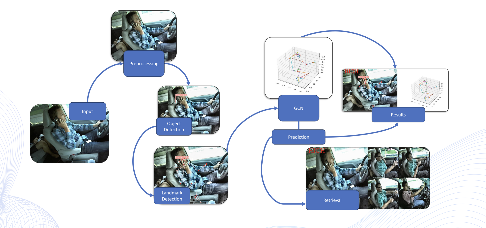
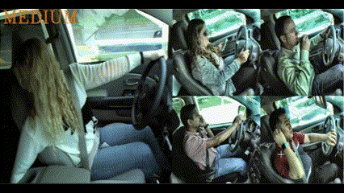

# Driver Distraction Detection

<table style="width: 100%; border-collapse: collapse;">
  <tr>
    <td style="text-align: center; border: 1px solid black;">
      <a href="3D_paper.pdf">📑 Final Report</a>
    </td>
    <td style="text-align: center; border: 1px solid black;">
      <a href="3D_slides.pdf">🖼️ Slides</a>
    </td>
  </tr>
</table>

## Abstract
This project tackles driver distraction, a major cause of road accidents, using Computer Vision and Machine Learning. It combines pose estimation with the MediaPipe framework and distraction source detection via a YOLOv7 CNN model to monitor drivers. The system classifies driver behavior into five risk levels and uses a Graph Convolutional Network (GCN) for enhanced analysis. Preliminary results show 90% accuracy, suggesting significant potential to improve road safety by alerting drivers or initiating corrective actions.

## Overview

# Model

- **Mediapipe**: Used for keypoint detection to analyze the driver's state.
- **YOLO (You Only Look Once)**: Employed for detecting potential distraction objects such as phones.
- **Graph Neural Network (GNN)**: Developed by us, that combine Mediapipe's output with the YOLO bounding box's coordinates, for the classification of the driver's state.

## Retrieval 

- **Faiss**: Library used to Retrieval part. Retrieval system returns the embedding images most similar a specified query. The process involves comparing the ground-truth classification (GNN) with the classification obtained through K-nearest neighbors (KNN) during the retrieval process with the K-embeddings.